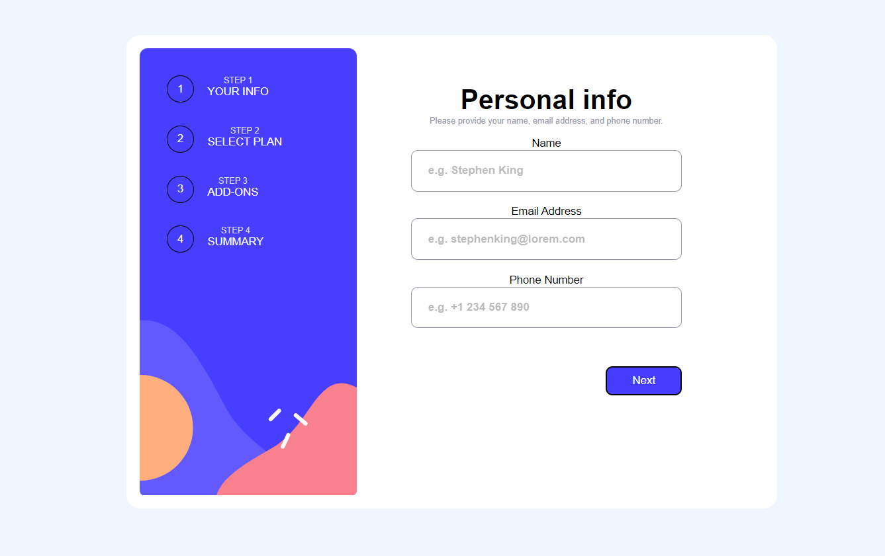

# Frontend Mentor - Multi-step form solution

This is a multi steps form or billing page, built to showcase my HTML,CSS and Javascript skills.

## Table of contents

- [Overview](#overview)
  - [The challenge](#the-challenge)
  - [Screenshot](#screenshot)
  - [Links](#links)
- [My process](#my-process)
  - [Built with](#built-with)
  - [What I learned](#what-i-learned)
  - [Continued development](#continued-development)
  - [Useful resources](#useful-resources)
- [Author](#author)
- [Acknowledgments](#acknowledgments)

**Note: Delete this note and update the table of contents based on what sections you keep.**

## Overview

### The challenge

Users should be able to:

- Complete each step of the sequence
- Go back to a previous step to update their selections
- See a summary of their selections on the final step and confirm their order
- View the optimal layout for the interface depending on their device's screen size
- See hover and focus states for all interactive elements on the page
- Receive form validation messages if:
  - A field has been missed
  - The email address is not formatted correctly
  - A step is submitted, but no selection has been made

### Screenshot




### Links

- Repo URL: [https://github.com/Fredeugine/multi-step-form-main](https://your-solution-url.com)
- Live Site URL: [https://fredeugine.github.io/multi-step-form-main/](https://your-live-site-url.com)

## My process

### Built with

- Semantic HTML5 markup
- CSS custom properties
- Flexbox
- Javascript

### What I learned
-I learned how to animate a checkbox, seemed complicated at first but becomes easy with practice
-I touched my hands on form validation, which was actually the most difficult part. My form had no summit button lol,
and it definitely gave me a headache.☺
-Learned to use javascript to control the flow and functions of each button. 
Overall, I loved this project even though, I forgot to follow good practices, such as (writing comments,use a ";" at then of each statement and naming variables with common words).
My skills have improved by a mile and I hope it will continue improving with each project. Cheers


```css
.proud-of-this-css {
  border: 1px solid var(--Light-gray);
  width: 9rem;
  height: 10rem;
  border-radius: 1rem;
  padding: 1rem;
  display: flex;
  align-items: flex-start;
  flex-direction: column;
  justify-content: space-between;
  background-color: var(--White);;
```
```js
const proudOfThisFunc = () => {
  circles.forEach((button, index) => {
    button.addEventListener("click", function clickButton() {
      // Set display property of clicked button to "flex"
      container[index + 1].style.display = "flex";
      // Set display property of all other buttons to "none"
      circles.forEach((otherButton, otherIndex) => {
        if (otherIndex !== index) {
          container[otherIndex + 1].style.setProperty("display", "none");
        }
      });
    });
  });
```


### Continued development

I will continue to practice form validation till I am perfect, and also
html adn css animations. Additionally , I will learn ways to write simple and less code. Fun fact: ChatGPT could summarise 80% of my code into a few lines.☺

### Useful resources

- [https://developer.mozilla.org/en-US/docs/Learn/Forms/Form_validation](https://www.example.com) - This helped me understand more about form validation

## Author

- Website - [Fred Eugine Adomako](https://www.your-site.com)
- Frontend Mentor - [@Fredeugine](https://www.frontendmentor.io/profile/yourusername)

## Acknowledgments
https://github.com/alishirani1384
